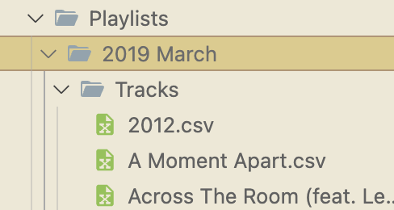

# Copy Google Play Music Backup to Apple Music

### Once you extract your google play music zip file, here's what it would look like:

## Requirements
- Apple Developer Account
- Apple Music User Token: can be generated [here](https://shivz3232.github.io/apple-music-user-token-generator/).
### ENV Values:
- APPLE_MUSIC_KEY_ID
- APPLE_MUSIC_TEAM_ID
- APPLE_MUSIC_PRIVATE_KEY_PATH
- APPLE_MUSIC_DEVELOPER_TOKEN
- APPLE_MUSIC_USER_TOKEN

## Steps
1. To copy a playlist to Apple Music, copy the directory path of the `Tracks` folder and use the command:
`go run . <directory-path>`

2. The playlist name created in Apple Music will be `Google Play Playlist: \<directory name>`
